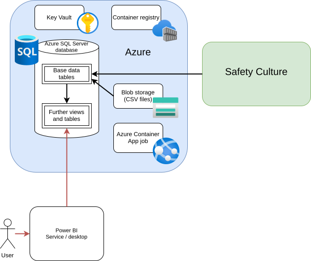

# Architecture and design

The architecture is shown in the picture below.

The components in this picture are as follows.

- The master copy of the current data is stored in the Safety Culture platform, which is the platform used for all inspections.

- An Azure resource group holds all of the tooling. All of this is deployed using a BICEP template.

    - An Azure storage account ("blob storage") holds CSV files containing historical data.

    - An Azure SQL Server database contains tables which match the data in Safety Culture and Views created of that data.

    - The tables and views are created and maintained by an Azure Container App Job, which logs to a local instance of Log Analytics.

    - The container image for the job is stored in a Container Registry.

    - As far as possible, all resources use Entra Authentication and managed identities to avoid any need for them to use passwords or secrets. The exceptions are that there is an access token for Safety Culture and a SQL database admin password; both of these are stored in an Azure Key Vault. The SQL Server database password (required by the Safety Culture exporter) is randomly generated automatically at deploy time, and can be regenerated by redeploying the BICEP template.

The data flows through the system as follows.

- Every day (in the morning, once the previous night's operations are complete) the Azure Container App Job runs. It performs the following steps.

    - It runs the Safety Culture exporter to load data from the Safety Culture API. The job maintains a record of when it was last successfully run so as to only perform incremental updates (as supported by the export tool).

    - Historical data in CSV files is loaded into tables.

    - Since the Safety Culture data format does not map well to what we wish to display, the data is mapped into a number of other views and tables. This mapping is described in the [data design doc](data.md).

- Users access the data using Power BI, deployed either in the Power BI Service or on the desktop. Power BI reads the data from the SQL Server database. Access to this data is controlled in one of two ways.

    - In the Power BI Service, the data is automatically updated once per day, using the admin account (whose credentials are not stored anywhere - this is Entra ID).

    - If using the Power BI desktop application, users must log in with their organisational accounts, which have been granted read rights to the database.

